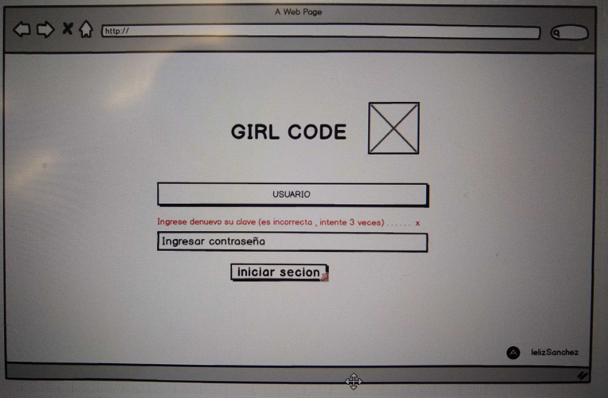
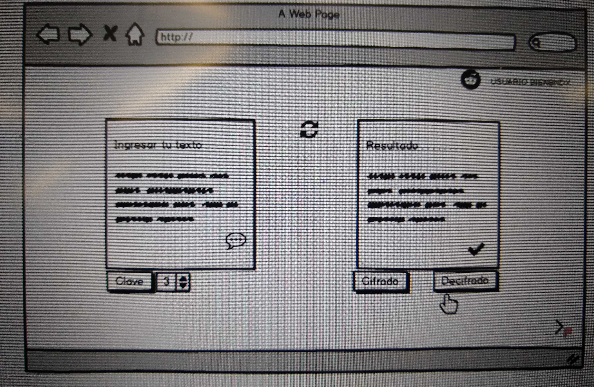

CODE GIRL

## Índice

- [Índice](#índice)
- [Resumen](#preámbulo)
- [Explicar quiénes son los usuarios y los objetivos en relación con el producto](#Explicar-quiénes-son-los-usuarios-y-los-objetivos-en-relación-con-el-producto)
- [Explicar cómo el producto soluciona los problemas/necesidades de dichos usuarios](#Explicar-cómo-el-producto-soluciona-los-problemas/necesidades-de-dichos-usuarios)
  - [UX ((Prototipo en lapiz y papel)](#ux-Prototipo-en-lapiz-y-papel)
- [Agregar un resumen del feedback recibido indicando las mejoras a realizar de su prototipo en  papel](#Agregarun-resumen-del-feedbac-krecibido-indicando-las-mejoras-a-realizar-de-su-prototipo-en-papel)
- [Imagen del prtotipo final en Balsamiq](#Imagen-del-prototipo-final-en-Balsamiq)

## RESUMEN
 Muchas de las chicas nesecitan su privacidad o tener codigos para poder comunicarse ya sea para cosas importantes .
 no solo nos servira para comunicarse sino tambien para poder guardar documentos sumamente importantes.
 como el feminicidio casos asi en las cuales las mujeres no hayan como poder contar sus problemas o la realidad de su vida.
 pienso yo que seria algo util ya que ellas pueden contar sus 

## Explicar quiénes son los usuarios y los objetivos en relación con el producto

El objetivo principal es para mujeres, programadoras
es para crear una aplicación o ya sea una página web de suma importancia ya sea creando informaciones secretas para la administración de una empresa o de acuerdo a lo que los usuarios pidan como para hacer una aplicación para abogados, etc 
Tengan documentos sumamente importantes minuciosamente utilizamos este método de césar 

## Explicar cómo el producto soluciona los problemas/necesidades de dichos usuarios

Dándole la seguridad de sus documentos o también incrustando claves para su mayor proteccion de cuentas o en general de acuerdo a la aplicación que nos sean asignadas por el usuario. 

## Requerimientos del proyecto

 
### UX (Prototipo en lapiz y papel)

![Imagen 1][1]  ![Imagen 2][2]

 [1]: IMG_20190531_110629764.jpg
 [2]: IMG_20190531_110637234.jpg "scaphandre"

## Agregar un resumen del feedback recibido indicando las mejoras a realizar de su prototipo en  papel

De acuerdo al feedback vi  diferentes puntos de vista de mis compañeras de trabajo en las que ellas me ayudaron a ver  pequeños detalles y a poder mejorarlo   que me ayudaron a mejorar mis ideas y ahi haces volar tu imaginación libremente .

## Imagen del prototipo final en Balsamiq

